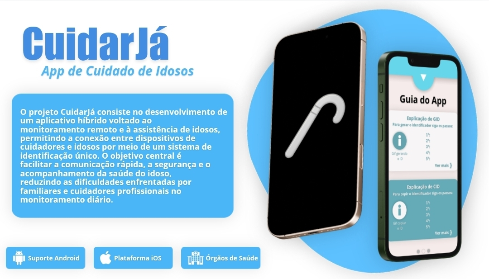

# CuidarJá

O projeto CuidarJá consiste no desenvolvimento de um aplicativo híbrido voltado ao
monitoramento remoto e à assistência de idosos, permitindo a conexão entre dispositivos de
cuidadores e idosos por meio de um sistema de identificação único. O objetivo central é
facilitar a comunicação rápida, a segurança e o acompanhamento da saúde do idoso,
reduzindo as dificuldades enfrentadas por familiares e cuidadores profissionais no
monitoramento diário.
